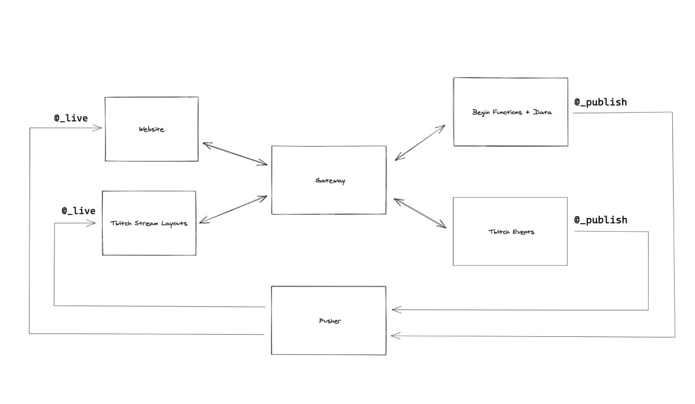

# The Worst Dev

This is my digital garden! I wanted to blur the lines between the many online communities I'm a part of and the spaces I've created. The goal is to build a federated data graph that gives me access to all the different places I interact with folks and share content.

## Architecture

This is a mono repo project. Backing data graphs are registered in Apollo Studio during CI and the gateway gets ✨automagically✨ updated by [Apollo Studio](https://studio.apollographql.com) pushing schema changes to it.

Realtime updates are broadcasted by backing services via a custom `@_publish` directive and captured on the client with a cooresponding `@_live` directive used on queries.

> For more on this type of archiecture, [check out this repo](https://github.com/apollographql/real-time-federation).

The backing services are deployed to [fly.io](https://fly.io) from GitHub Actions and the website id deployed to [Netlify](https://netlify.com).

### Directories

- **website**: This is a next.js app deployed to Netlify. Not only does this power my website, but will also include my dynamic stream scenes I use for Twitch.
- **website-service**: This is a GraphQL API that stores and broadcasts events related to the core website (right now likes for content).
- **twitch-service**: This is a GraphQL API that broadcasts events related to my personal Twitch stream (may update to include Apollo stream).
- **gateway**: this is the `apollo-gateway` which is the entry point for my federated graph.
- **.github**: this is the github workflows for registering and deploying the backing GraphQL APIs and the Gateway.
