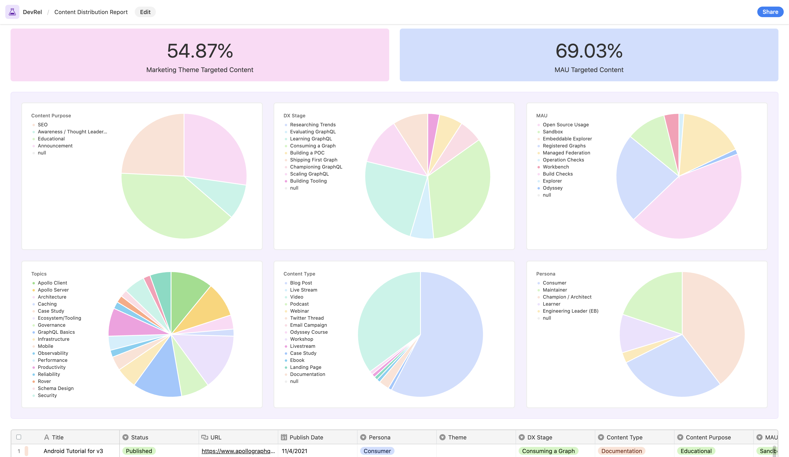

Measuring and reporting on developer advocacy work is the least established part of DevRel because it tends to be ambiguous. In addition, developer advocacy often involves helping other teams with _their_ goals, which can obscure _our_ impact. When combined with not having a reliable set of metrics that others in the company trust, you can find yourself in situations where there isn't much visibility into the value you're bringing.

Often, DevRel teams who can't work through this ambiguity fall into a trap: 1. Abandon their *own* metrics and instead work towards metrics owned by and credited to other teams like product and marketing. 2. Never find time to define their metrics and goals. 3. Fail to take on important initiatives that fall outside their existing reporting metrics.

As developer advocates, avoid becoming extensions of other teams by closely learning **metrics:** the different types you'll encounter and when to use them, which are trusted and untrusted, and how to build them effectively to support _your team's_ goals.

> ⚠️ The goal of this post is to provide you with enough context about developer advocacy and metrics that you can make informed decisions about what to measure and how to gain trust in those metrics if needed.

## An Introduction to Metrics

Metrics are the data points you use to track the progress of your work, gauge the effectiveness of your initiatives, and look for insights to help guide your decision-making. Metrics aren't unique to developer advocacy (or DevRel in general). Still, because DevRel is a newer function, you face some distinctive challenges most other well-established functions like Marketing and Product don't.

**You don't have well-established metrics to rely on.**

If you want to measure and report on your work successfully, we need to have a deep understanding of how companies think about metrics, have the company in alignment with the value developer advocates bring, and then build a strategy based on that foundation.

Let's examine the different types of metrics you'll likely encounter.

### Qualitative and Quantitive Metrics

Metrics are often defined in terms of whether or not they are measuring quality or quantity. More specifically, are you dealing with a metric that can roll up into a numerical representation, or is it too hard to quantify?

#### Qualitative metrics

Qualitative metrics are data points that numbers can't define. As a result, it can be hard to maintain trust in qualitative metrics as companies grow and become more data-driven.

Examples of qualitative metrics are

- Comments from feedback forms
- Social media interactions
- Direct feedback from community members that you record

#### Quantitive metrics

Quantitive metrics are data points that numbers can define. Most well-established metrics are quantitative because numbers are easier for other functions and leaders to digest, which results in more trust.

Examples of quantitative metrics:

- Monthly active users (products, platforms, etc.)
- Content quality (average time on page, bounce rate, average watch time for videos, etc.)
- Content distribution (percentage of content covering specific topics, themes, personas, etc.)

### Trusted and Untrusted Metrics

One of the biggest "ah-ha" moments I had when trying to figure out how to measure developer advocacy was that sometimes even when you're measuring the right things, others won't automatically trust the connection between your metrics and the impact you say it represents.

#### Trusted metrics

Trusted metrics are the metrics that have become established within a given team/company/industry. These metrics are often quantitative and are generally used to gauge the success of a project/initiative/product/team/company.

Not all metrics are equally trusted either! It turns out, the more degrees of separation between your metric and your company's north start metric (will generally be revenue related), the less likely it is to be trusted. For example, [ARR (annual recurring revenue)](https://www.zuora.com/billing-topics/annual-recurring-revenue/) is a prevalent north star metric.

It's a quantitative metric that directly reflects the company's success because the goal of all companies is to generate revenue. So, there is also little need to establish trust because there are no degrees of separation between it and revenue. Regardless of the close connection to revenue, it's also now an industry-standard metric that brings trust with it.

Every other metric downstream of ARR is part of a **chain of trusted metrics.**

> The chain of trusted metrics is the graph representation of metrics trusted to impact other metrics throughout an organization.

#### Untrusted metrics

Untrusted metrics are the metrics that are not established yet within a team/company/industry. These metrics can be qualitative or quantitative, but generally, as a company grows, it becomes more data-driven, resulting in less trust in qualitative metrics.

An example of an untrusted metric would be using survey feedback results as a success metric. Survey feedback might be a trusted metric at the team level, but that doesn't mean it will automatically become part of the chain of trusted metrics. I wondered why I constantly had to reinforce my quantitative metrics with **proof of impact** for a long time.

> Proof of impact is when you have to prove the connection between your metrics and the trusted metrics they impact.

Just because you show a report doesn't mean others trust the associated impact on the business. If you can't convince the owner of a trusted metric that your metrics are also driving them, it doesn't matter how much actual impact you're creating because you won't be able to report on it.

### Success and Insight Metrics

There is no such thing as a bad metric, no matter what anyone tells you. A metric is a data point. It can't be good or bad. However, folks will use metrics for things that are not a good fit and write it off as useless or bad. The most common example of this is **vanity metrics**.

> Vanity metrics are metrics that make you look good to others but do not help you understand your own performance in a way that informs future strategies.

If you've been doing developer advocacy for any time, I'm willing to bet just reading the phrase vanity metrics makes you feel uncomfortable. After all, we've been trained to avoid them at all costs.

It's not about whether a metric is good or bad. It's about whether or not you should be using it to define success or to gain insight.

#### Success metrics

Success metrics are the metrics used to gauge the success of an initiative/team/function/company. Success metrics are generally quantitative and need to be trusted metrics. These are the metrics every team uses to communicate the impact they are having on the company.

An example of a success metric is MAUs (monthly active users). Folks often use it with product responsibilities to gauge the success of the features/services they are responsible for. Other teams and executives also trust MAUs to represent the positive or negative impact of the product on the business.

> An excellent way to identify success metrics is to ask yourself two questions "Would I change what I was doing if these numbers changed?" and "Will this be true for an extended period?" If the answer is yes to both, it's a strong candidate for a success metric.

#### Insight metrics

Insight metrics are the metrics used to look for a correlation between data points and hypotheses. However, these metrics are often not suitable for success metrics because they are generally only indicators and don't provide enough clarity about the impact they represent.

An example of this is GitHub stars. A repository getting a lot of engagement through stars is an indicator of something. Still, it lacks the clarity to tell us anything more substantial about **WHY** someone interacted with the repository or **WHAT** action they took after that would impact another trusted metric within the company.

GitHub stars aren't a good measurement of success, but that information isn't useless. It still takes energy to click a button, and they did it for a reason. Is the repository a tool you made to help ease a developer pain point? Maybe it's an example app using a specific framework? That's an insight into the friction developers face or popular trends and can reveal a lot about a community.

> I often rely on insight metrics to help me identify trends or areas of friction that are currently going unnoticed. A good indicator of a quality insight is when the metric is way off from your expectations! That is worth investigating!

## Defining the Value of Developer Advocacy

In the article ["Growing Your Career as a Developer Advocate](https://www.samjulien.com/growing-your-career-as-a-developer-advocate)," Sam Julien defines the value of developer advocacy or DevRel as an **arbitrage opportunity:**

> What is the asset here? Simply put, it's *you*: your ability to build an audience, notice trends, build credibility, and make an impact on a developer community. As a developer, you've got the [credibility] needed to be genuinely embedded in developer communities. As an advocate, you've got the influence to make a difference and educate.

This arbitrage opportunity that Sam speaks about is what I call the **Developer Advocacy Value Cycle.** A developer advocate's value increases as they build momentum by constantly working through this cycle because the work done in each step of the process positively impacts the next one. More specifically, your community and company relationships will continue to provide more insight to help you provide more value internally and externally.

### Developer Advocacy Value Cycle

The Developer Advocacy Value Cycle (DAVC) is similar to Mary Thengvall's ["DevRel Path to Success,"](https://www.marythengvall.com/blog/2021/3/9/the-devrel-path-to-success-awareness-enablement-engagement) except **awareness** is replaced with **impact**. Impact is used for two reasons:

1. Developer advocates are force multipliers, internally and externally, and our internal impact is underrepresented in DevRel success models.
2. Awareness is generally a responsibility of marketing. Many DevRel teams work cross-functionally (this is how we work at Apollo) or are part of other functions like product or engineering. Therefore, using an umbrella term like impact allows for the flexibility of the DevRel responsibilities we see in today's industry.

#### Engagement

Engagement is the foundation of developer advocacy. The person who gains the most value from engagement is you.

**As developer advocates, we can do the one thing neither company nor community can do, exist in both worlds.** The actual value of developer advocacy is the context you gain by innately knowing the needs, frustrations, and joys of both sides of the more significant relationship, the one between the company and the community. The deeper we embed ourselves into each world, the more context we gain, becoming more effective.

Sarah Drasner was on to this back in 2019:

By putting the focus on context, we separate the value of developer advocacy from the individual. The context you have can be passed on to others or combined with more context from other developer advocates. Lastly, it helps reduce the stigma around needing an established community presence to become a developer advocate, making the field more approachable to others.

**Build the relationships to build the context.**

#### Impact

Impact is the value you bring to the company by providing context to internal teams. Examples of impact are helping marketing and sales teams with messaging and content, giving feedback and insights to product and engineering teams, or other cross-functional initiatives that bring more users to the company (pushing for a new pricing strategy, etc.).

**Who are you impacting?**

Where DevRel sits within the organization will mainly determine who you impact because where DevRel sits within a company largely influences what goals, metrics, and initiatives developer advocates take on.

##### Marketing

In this org structure, DevRel operates as a team within the marketing function of the company. Generally, your goals will focus on **top-of-funnel** and possibly **qualified leads**. Most of your work will be outbound focused, like creating content, building example projects, speaking at events, and networking with developers at events.

> Sam Julien's article, ["Growing Your Career as a Developer Advocate](https://www.samjulien.com/growing-your-career-as-a-developer-advocate)," which I referenced previously, discusses the value of developer advocacy through a marketing lens.

##### Product/Engineering

In this org structure, DevRel operates as a team within the product function of the company. Generally, your goals will focus on driving **MAUs (monthly active users)** and providing product feedback. Most of the work you do is still likely to be outbound focused. Still, there is generally a more considerable aspect of 1:1 developer interaction to figure out how people use the products you're responsible for.

> In a recent YouTube video ([6:09 - 11:32](https://youtu.be/yTaOgc9i-o4?t=369)), Brian Douglas discusses the value of developer advocacy through a product lens.

##### Developer Experience/Developer Relations

In this org structure, DevRel operates as its function or within a Developer Experience function, but outside of any other functions commonly associated with DevRel. Because of this unique structure, it's not quite as clear-cut what goals you'll have or what metrics will matter the most.

The reason is that you lose the adopted trust you get from being in another established function and must come up with our metrics to represent the impact you have across the company because none of the existing trusted metrics will tell the whole story. Aside from the issue of existing metrics not telling the entire story, another team already has ownership of that metric. You'll never "out metric" the metric owner, so your impact can seem less relevant in comparison to a function fully devoted to driving it.

Even so, this is still my preferred org structure for DevRel teams. I believe that our context is too valuable to isolate to a given function or team, even if it makes your work harder to measure.

I see Developer advocacy as similar to being a principal engineer. You work cross-functionally within a company and identify gaps and opportunities that impact the business (and, in our case, the community) using the context you've accrued from the internal and external relationships you've built.

> My most considerable contributions to the community have all resulted from the change I initiated internally based on the friction that developers were experiencing.

Being so closely tied to one function, and therefore metrics can hinder a developer advocate's ability to impact other areas. For example, if you're in marketing, your goals will most likely be focused on top-of-funnel, which leaves little room for initiatives that might benefit other teams greatly.

> In her article, ["Developer Experience at Netlify](https://www.netlify.com/blog/2021/01/06/developer-experience-at-netlify/)," Sarah Drasner discusses how DX (developer experience) at Netlify works as its own function. Note: Technically, I don't think the DX team is organizationally outside of all other functions, but they do still operate a lot like a cross-functional team. It's worth reading for another perspective of DX as its function (more accurately, with their own goals and metrics).

##### Enablement

Enablement is the value you bring to the community by removing friction from their workflows through our impact, listening to their frustrations and joys to gather feedback, building projects and creating content to fill information gaps, supporting developers by creating opportunities and connecting community members (being a [tummler](https://dangerouslyawesome.com/2014/04/community-management-tummling-a-tale-of-two-mindsets/)), and by recognizing and rewarding their contributions.

The most significant impact DAs can have by far is removing friction from developers' workflows. Removing friction has the added benefit of improving the metrics decision-makers care about directly and is generally the most valuable thing you can give to a community.

- Improve onboarding? You are helping reduce churn and making it easier for developers to use a service they need.
- Provide feedback on an API? You're helping MAUs and making it easier for developers to work with your platform.
- Are you pushing for a consumption-based pricing strategy? You're helping non-enterprise ARR and enterprise conversion, MAUs by opening more features to more developers, helping top-of-funnel by providing a new compelling campaign for marketing, and assisting developers by making more of the platform available to them.

As developer advocates, we can walk through developer workflows (**search to success**) and document our experience, applying our context from both worlds. This process allows us to identify friction that is otherwise unknown to others and provide actionable steps to remove the friction.

> Learn more about addressing product friction in "[The Developer Advocate's Guide to Addressing Product Friction](/developer-advocates-guide-to-addressing-product-friction)."

Enablement is the foundation to building lasting relationships in the community. Developers will come to rely on you, confide in you, and often start to advocate for you because they know you're putting in the work to help them. However, if they don't think you're advocating for changes that benefit them or invested in their success, they won't come to you with feedback!

#### Measuring the Developer Advocacy Value Cycle

When it comes to representing this "value" in an actual report, I've landed on three questions that, if answered through metrics, will tell whether or not you're being successful with this model:

- Are we building the right relationships (internally and externally)?
- Are we helping the company be successful?
- Are we helping developers be successful?

If you're reporting on something that isn't answering one of these questions, or one of these questions isn't represented in your reporting, then something needs to change!

> Regardless of the framework you choose to represent the value of developer advocacy, you'll want to come up with a few key questions to answer that represent what the outcome of your actions should be.

## Tips for Measuring Developer Advocacy

This section focuses on tips for measuring Developer Advocacy based on the DAVC (Developer Advocacy Value Cycle). The goal is to use your newly gained knowledge of metrics, the steps of the DAVC, and these tips to figure out what you should measure, how to measure it, and how to build trust in those metrics if needed.

### Don't measure that which is already counted.

The goal is to find metrics that represent **your** work and are trusted to drive the metrics of others. If you try to use metrics that are already owned by another team/function, then you run the risk of:

1. Finding ourselves inadvertently competing against a team you should be impacting.
2. Never being able to produce the same results as a team dedicated to that metric ("Why do we need DevRel when Product does better at driving MAUs?", etc.).
3. Doing the same work that another function already does well.

> Developer advocates should avoid doing work that other teams already do well! Instead, look for ways to impact that work with your unique context.

### You can't measure that which you don't record.

One of the most valuable lessons I've learned (from the amazing [Stephanie Morillo](https://twitter.com/radiomorillo)) about developer advocacy, or devrel in general, is that tracking the work you do is fundamental to your success. I was lucky enough to be in one of Stephanie's cohorts for DevRel training. She was specifically talking about having a content database to make it easier to surface our work.

We record our work related to each part of the DAVC in tools like [Airtable](https://airtable.com/) and [Orbit](https://orbit.love/). Both of these tools provide reporting capabilities which are now the basis of our reporting strategy at Apollo.

> Being able to record your work means you need enough structure to make the work a DevRel team does similar enough to measure consistently. An example is delivering feedback to product teams. If each developer advocate uses a different approach to provide feedback, it won't be easy to record that work accurately.

### If the metrics change and you don't, stop measuring it.

If you're not taking action in response to the metric going up or down (or qualitative getting better or worse), then you shouldn't be measuring it. You're wasting effort, and other functions will be more aware than you think. Not reacting to the metrics you are telling others are driving their metrics can hurt any trust you've established!

### Be intentional with your initiatives.

In her blog post, ["First, Understand the Company Goals](https://www.marythengvall.com/blog/2020/12/14/first-understand-the-company-goals)," Mary Thengvall covers how to decide what initiatives to take on concerning the metrics you're using to define your success using Libby Boxes (a predictive framework you can use to connect experiments and initiatives to goals).

> Reporting can feel like the enemy experimentation or taking on important work that is hard to quantify, but it doesn't have to be. Budget time for work that you won't report on. You can't plan for everything, but that doesn't mean you shouldn't have a plan!

### Have a paper trail for untrusted metrics.

The most challenging part of developer advocacy (or any newly established role/function) isn't figuring out what to measure. The hardest part is that sometimes you have to build trust in those metrics (especially ones related to internal impact). However, just because others don't trust our metrics yet, doesn't mean we're measuring the wrong thing. Instead, it means we're not drawing a clear enough line between that work and the trusted metrics.

> Check out [The Developer Advocate's Guide to Addressing Product Friction](/developer-advocates-guide-to-addressing-product-friction) to learn more about building frameworks for developer advocacy work related to internal success and how to provide proof of impact.

## Conclusion

Successfully measuring and reporting is all about understanding how companies treat metrics, and the value developer advocates bring to a company. By understanding these two concepts, you can map out a path between your metrics and your company's north star metric.

It's important to remember that some metrics aren't trusted yet, and sometimes you'll have to build trust in those metrics if you want to use them to measure your success. So remember to only report on the metrics you use to guide your decision-making and represent the value you bring to your company.
